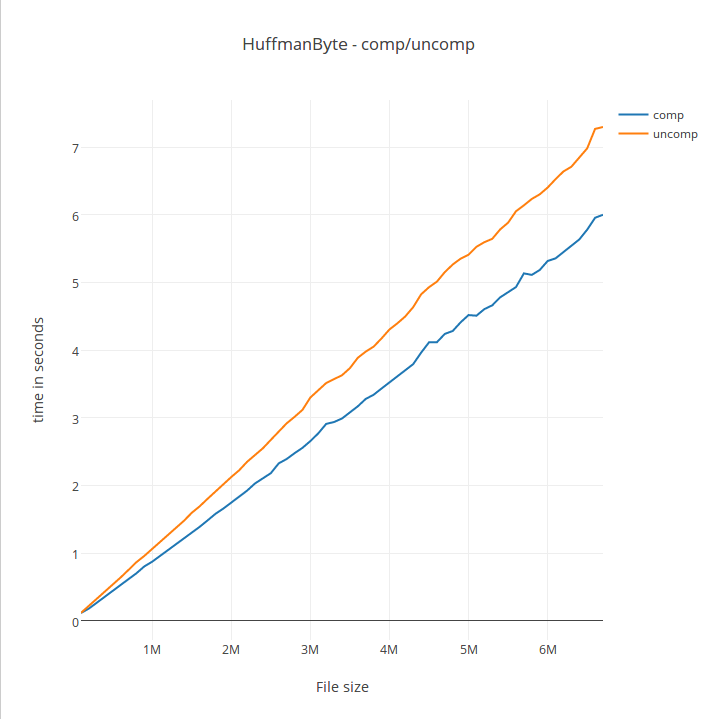
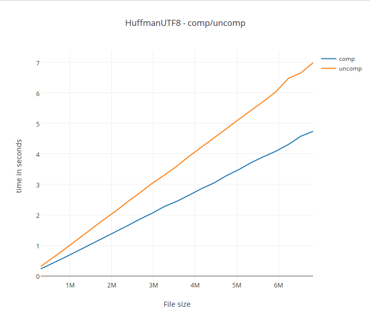
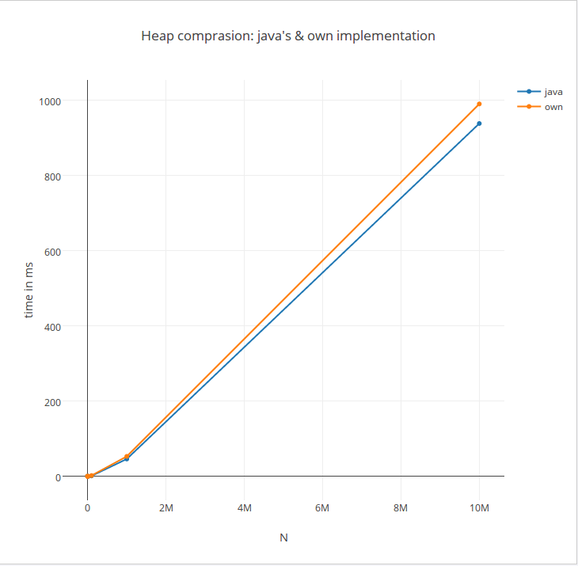

# Testausdokumentaatio

## Tiedoston pakkauksen tehokkuus ja vertailu:

Oheisissa taulukoissa pakkauksen tuloksia. Kaikki esimerkkitiedostojen purkun ja pakkauksen jälkeinen tiedosto on vertailtu MD5-hashillä alkuperäiseen.

#### Luonnollinen kieli:

Kuten alussa oletin, tiedostot pakkautuvat tehokkaammin viereita kieliä, jotka käyttävät yli tavun pituisia utf-8merkkejä, utf-8 tunnistavalla Huffmanin koodauksella. Pääosin ASCII-merkeistä koostuvat eivät pakkaudu paremmin utf8:lla, sillä ASCII-merkit ovat tavun pituisia.

|tiedoston nimi|alkuperäinen koko|tavu pakkaus|% alkupräisestä (tavu)|utf8 pakkaus|% alkuperäiestä (utf8)|kieli|
|---|---|---|---|---|---|---|
|wikipedia_japanese_title:_日本語.txt|274 502|195 666|~71%|122 490|~45%|japani|
|wikipedia_japanese_title:Wikipedia_talk:Arbitration_Committee_Elections_December_2013|276267|173653|~63%|173065|~63%|englanti|
|wikipedia_chinese_title:中华人民共和国.txt|340 862|280262|~82%|219 216|~64%|kiina|
|wikipedia_english_title:Template_talk:Euro_convergence_criteria.txt|272 568|165 659|~61%|165 590|~61%|englanti|

Tiedostot löytyvät sijainnista: <linkki>

#### Satunnaissyöte:

##### Satunnaisgeneroitu data:

|tiedosto|alkperäinen koko|tavu pakkaus|% alkuperäisestä|
|---|---|---|---|
|random1.dat|5242880|5247327|~100%|
|random2.dat|5242880|5247301|~100%|
|random3.dat|5242880|5247317|~100%|

Tiedostot löytyvät sijainnista: <linkki>

## Pakkauksen ja purun ajankäyttö:

Vertailua purun ja pakkauksen ajankäytöstä.

Kuvaajien data löytyy kansiosta doc/testaus.

### HuffmanCompresionByte

Koodi: badcompression.performanceTesting.CompressionUncompressionTests.java

### HuffmanCompressionUTF8

Koodi: badcompression.performanceTesting.CompressionUncompressionTests.java

## MinPriorityQueue vs. javan PriorityQueue

MinPriorityQueue on toteutettu MinBinaryHeap:lla. Oheisessa taulukosta nähdään miten itsetoteutettu tietorakenne pärjää javan kirjastossa olevaa vastaan. Testit ovat ajettu 10 kertaa per n ja testiajojen keskiarvo näkyy taulukossa.

Koodi: badcompression.main.Heaptesting.java
